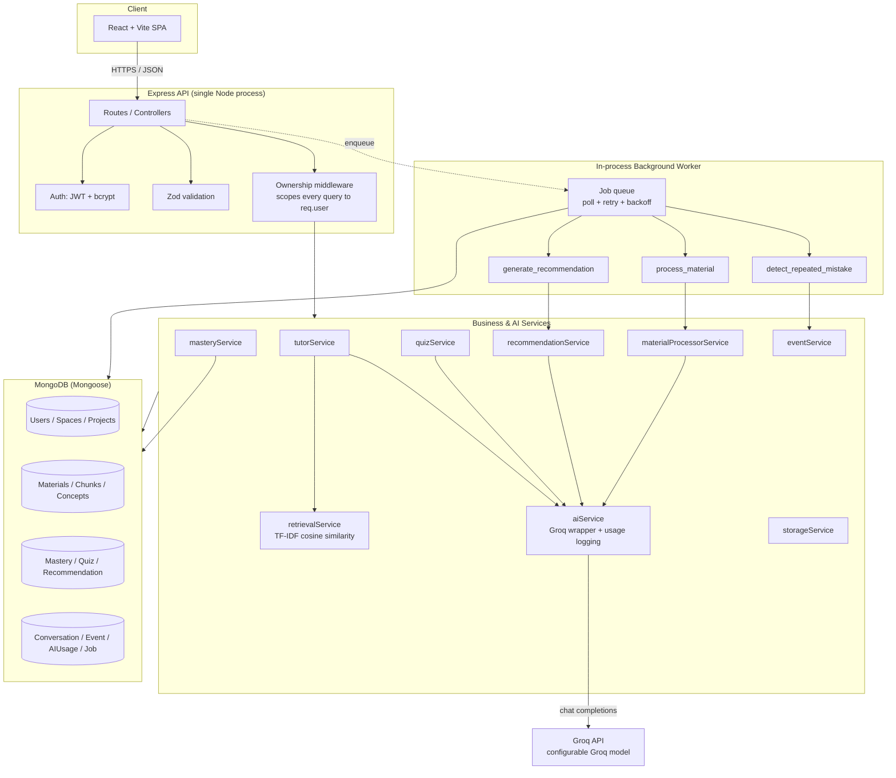

# Architecture

## Diagram



## Layer responsibilities

- **Frontend (React SPA):** Auth, Spaces/Projects CRUD, Material upload +
  status polling, Tutor chat, adaptive Quiz flow, Growth/Analytics views,
  Admin Dashboard. Talks only to the backend's `/api/*` routes.
- **API layer (Express):** thin — parses/validates input (Zod), authenticates
  (JWT), authorizes (ownership middleware scoping every query to
  `req.user`), and delegates to services. Controllers never touch AI calls
  or Mongo queries directly beyond simple reads for their own resource.
- **Services:** all business logic and every AI interaction. This is where
  the PRD's "Context First", "Evidence Over Guessing", and "Safe AI
  Interaction" principles are actually enforced in code (see below).
- **Background jobs:** an in-process queue (see "Key decisions") backed by a
  `Job` Mongo collection, processed by a worker loop started alongside the
  API server.
- **Data layer:** MongoDB via Mongoose. Every project-scoped collection
  carries both `user` and `project` fields so ownership and isolation
  checks are index-backed and consistent.

## Request flow: AI Tutor (representative example)

1. `POST /api/projects/:projectId/tutor/ask` → `protect` (JWT) → `ownsResource(Project)` loads `req.project`, 404s if it doesn't belong to `req.user`.
2. `tutorService.askTutor` retrieves top-K chunks **scoped to `projectId`** via `retrievalService` (TF-IDF cosine similarity) — this is the "Context First" guarantee: a query can never surface another Project's material.
3. If no chunk clears the relevance threshold, the Tutor returns a canned "insufficient evidence" response **without calling the AI** (saves cost, guarantees the unsupported-question behavior is deterministic).
4. Otherwise, retrieved chunks + rolling conversation summary + recent turns + the Project goal are composed into a system/user prompt instructing the model to answer only from the provided excerpts and to flag insufficient evidence itself, with `response_format: json_object` for a reliable `{ answer, insufficientEvidence, citedSources }` shape.
5. The model may call `get_concept_mastery` (a validated, server-side-executed tool) to calibrate explanation depth — this is the "Structured Tool / Application Request → Backend Validation → Execute" pattern from PRD section 8.
6. Every Groq call, success or failure, is logged to `AIUsage` (model, tokens, latency, estimated cost) via `aiService.chatComplete` — the single choke point all AI calls go through, which is what makes the Admin/Analytics AI-usage views possible.
7. The answer + citations are appended to the Project's `Conversation` (windowed to the last 12 messages; older turns get folded into a `summary` field via a small AI call) and an `Event` is logged for analytics.

## Key decisions & why

**TF-IDF retrieval instead of vector embeddings.** Groq (the chosen AI
provider, per the stack decision) does not expose an embeddings endpoint,
and this sandbox/environment has no path to a second provider or a
downloadable local embedding model without adding real deployment
complexity disproportionate to a prototype. TF-IDF cosine similarity is
deterministic, needs no external calls, and is fully swappable later — see
`docs/LIMITATIONS.md` and `retrievalService.js`'s header comment for the
upgrade path (Mongo Atlas Vector Search, pgvector, Pinecone, etc.).

**In-process job queue instead of BullMQ/Redis.** The PRD requires
background processing with retries, duplicate-job handling, and recovery —
but not a specific broker. A `Job` Mongo collection + an in-process poll
loop (`backend/src/jobs/queue.js`) gives the same *behavioral* guarantees
(persisted state, idempotency via unique `idempotencyKey`, exponential
backoff, survives a server restart because state lives in Mongo, not
memory) without standing up Redis for a prototype. The tradeoff: it doesn't
horizontally scale across multiple server instances the way a real broker
would, since each instance runs its own poll loop against the same
collection (this is actually safe today because `findOneAndUpdate` is
atomic — two instances won't double-process the same job — but throughput
is limited to one poll loop's cadence). Swapping to BullMQ later means
replacing `queue.js`'s `enqueue`/worker with BullMQ equivalents; `handlers.js`
and every service stay the same.

**Local disk storage by default, Cloudinary stubbed.** Keeps the prototype
runnable with zero extra account setup. `storageService.js` isolates the
one function (`saveFile`) that would need a real implementation to switch
to Cloudinary or S3.

**Structured JSON output for every generative AI call.** Every Groq call
that returns something the app parses (Tutor answers, quiz questions, quiz
grading, concept extraction, recommendations) uses
`response_format: { type: 'json_object' }` with an explicit schema in the
system prompt, rather than parsing free text. This is what "AI-generated
structured data should be validated before it is persisted" (PRD section 8)
looks like in practice — JSON parse failures are caught and handled
per-feature (e.g., concept extraction failing doesn't fail the whole
material pipeline).

**Ownership middleware as the sole authorization gate.** Every
project/space-scoped route uses `ownsResource(Model, param, key)`, which
404s (not 403s) on a resource that exists but isn't the caller's — this
avoids leaking the existence of other users' data and is the single place
Project-level data isolation is enforced, rather than scattering `user`
filters through every controller.


## Deployment topology

The app is deployed as three separate pieces:

```
Vercel (static React build)
      |  HTTPS /api/*
      v
Render (single Node process: Express API + in-process job worker)
      |
      v
MongoDB Atlas (M0 free tier)
      |
      v
Groq API (chat completions)
```

- **Frontend on Vercel**, root directory `frontend`, with a `vercel.json`
  rewrite so React Router deep links like `/projects/:id/tutor` resolve to
  `index.html` instead of 404-ing on refresh. `VITE_API_BASE_URL` must
  point at the Render URL and end in `/api`.
- **Backend on Render**, root directory `backend`. It has to be a normal
  web service rather than anything serverless, because the background job
  worker is an in-process poll loop that needs a long-running process —
  serverless would mean queued jobs never get picked up between requests.
- **`CLIENT_URL` accepts a comma-separated list** of allowed origins rather
  than a single value, so production, preview deploys and local development
  can all talk to the same backend.

### Two decisions worth calling out

**Fail closed on error detail.** The error handler originally hid stack
traces when `NODE_ENV === 'production'`. That's backwards: if the variable
is unset — which is exactly what happened on the first Render deploy —
every error response leaks internal file paths and directory structure. It
now only exposes stacks when the environment is *explicitly* `development`,
so missing configuration degrades to the safe behaviour rather than the
unsafe one. Stacks are still written to server logs; they just don't go
back to the client.

**A root route that looks intentional.** `GET /` originally 404-ed, since
only `/health` and `/api/*` are mounted. It now returns a small JSON
descriptor, so hitting the bare backend URL reads as deliberate rather than
broken.

### Free-tier constraints this runs into

Documented in full in `docs/LIMITATIONS.md`, but architecturally relevant:
Render's free tier has an ephemeral disk (so locally-stored PDFs don't
survive a redeploy, though the derived chunks in Mongo do), and spins the
instance down when idle (so the job worker sleeps with it). The queue
design already handles the second case correctly — job state is persisted
in Mongo with idempotency keys rather than held in memory, so work resumes
on wake without duplicating.
